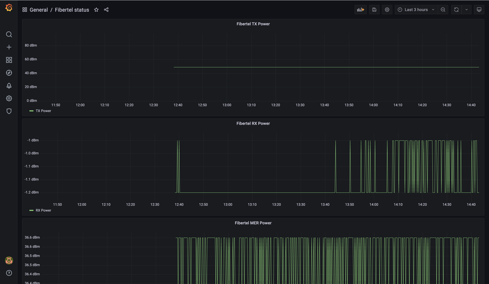

# fibertel-prometheus

Based on [fcingolani's fibertel-stats](https://github.com/fcingolani/fibertel-stats)

## RX and TX recommended values

Values are based on DOCSIS standards

### Rx

| Estado                  | Mínimo      | Máximo      |
|-------------------------|-------------|-------------|
| Recomendado             | -7 dBmV     | +7 dBmV     |
| Aceptable               | -10 dBmV    | +10 dBmV    |
| Máximo tolerable        | -15 dBmV    | +15 dBmV    |
| Fuera de Especificación | < -15 dBmV  | > +15 dBmV  |

### Tx

| Versión     | Mínimo    | Máximo    |
|-------------|-----------|-----------|
| DOCSIS 3.1  | +35 dBmV  | +47 dBmV  |
| DOCSIS 3.0  | +35 dBmV  | +49 dBmV  |


## Testing
```bash
cd server
docker-compose up
```
Then access Grafana on [http://localhost:3000/]()


